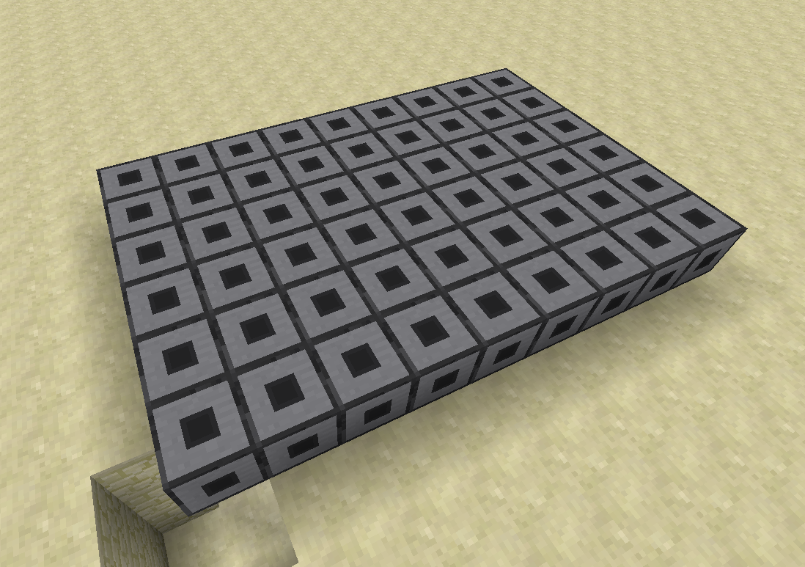
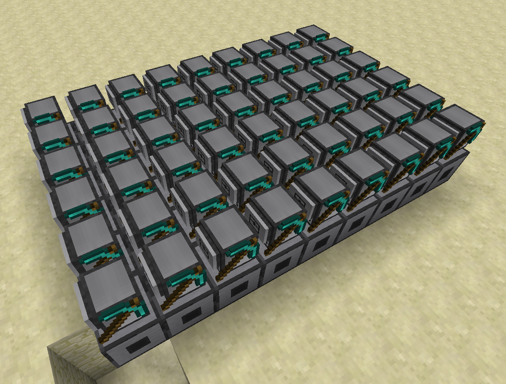
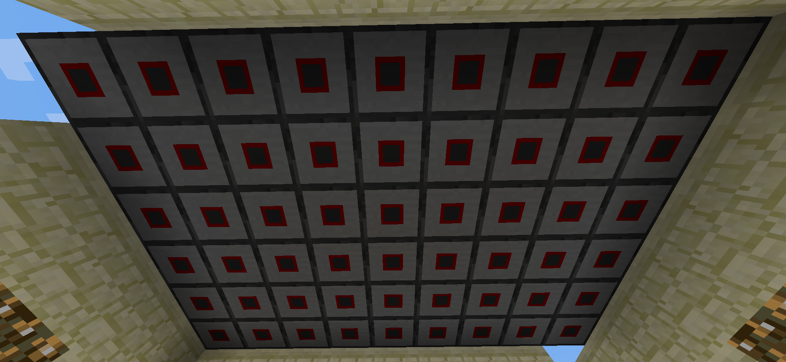
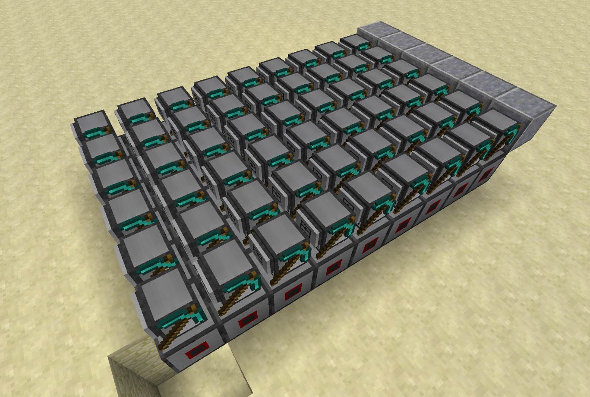
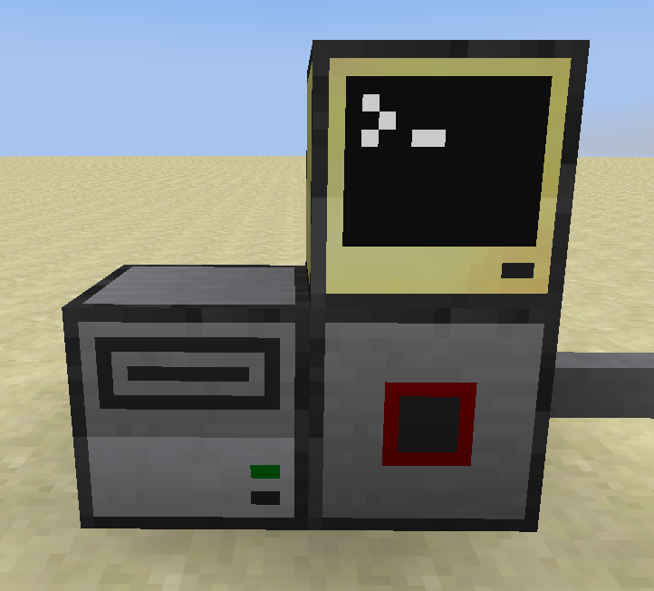
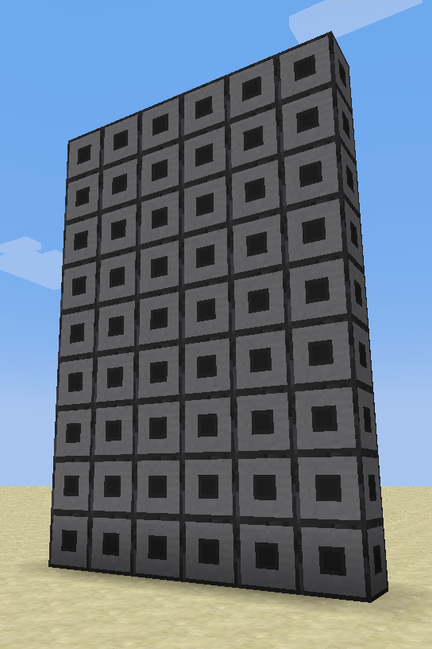
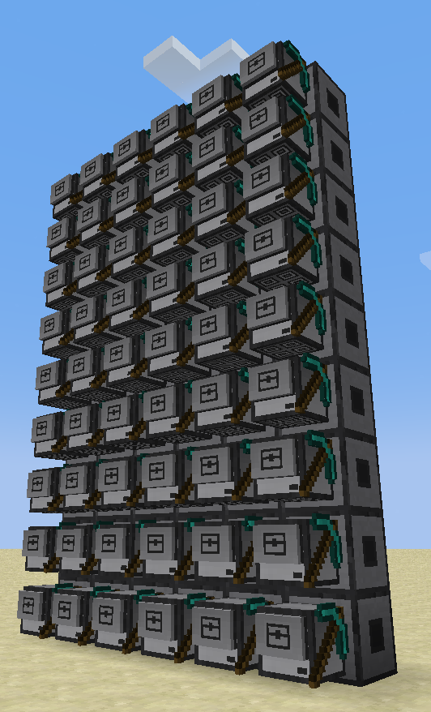
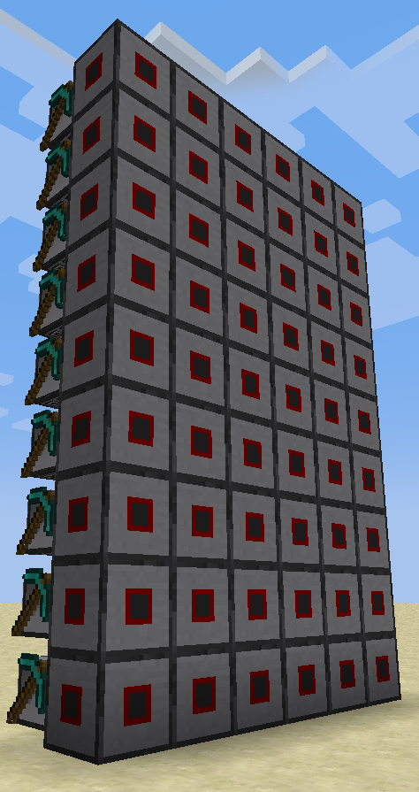

# Turmitor

Build a gigantic monitor out of an array of turtles! Make automatically updating
map-art! No guarantee on any sort of stable TPS while this is running!

Turtle + Monitor = Turmitor

```diff
===================================================================
@@                            WARNING                            @@
===================================================================
- Turmitor is still in development, and is not yet ready for use. -
-        You will not get it to work in its current state!        -
===================================================================
```

## Setup

Turmitor requires a fair amount of setup, and *a lot* of concrete (or other
blocks). Follow the steps below to get Turmitor running on your world!

### Step 1: Decide how large you want your Turmitor to be

Turmitor can be fairly large, with a maximum CC terminal width of 51 (height is
technically unbounded, but should be kept below 80 to avoid issues with
overlapping communication channels). Each character is 6x9 pixels, so keep that
in mind when deciding how large you want your Turmitor to be.

For an example, let's say we want to build a Turmitor that is a small 3x3
characters. In total, this would be 18x27 (486) pixels. For each pixel, you will
need the following:

1. A Turtle (with a pickaxe!)
2. A Wired Modem (in full block form)
3. One of each 16 different types of blocks (defaults to the 16 colors of
concrete)

Thus, in order to build a 3x3 Turmitor, you will need 486 of each of the above
items. In total, if we are counting from base resources, you would need:

1. 1094 logs (2 logs per turtle + 0.25 logs per pickaxe)
2. 3402 Iron Ingots (7 ingots per turtle)
3. 1458 Diamonds (3 diamonds per pickaxe)
4. 7290 Stone (7 stone per basic computer + 8 stone per modem)
5. 186 Blocks of Glass (1 glass pane per basic computer -> 486 panes required,
16 panes per 6 blocks of glass)
6. 972 Redstone (1 redstone per basic computer, 1 redstone per modem)
7. 3904 Sand (4 sand per 8 concrete)
8. 3904 Gravel (4 gravel per 8 concrete)
9. 976 Dye (1 dye per 8 concrete, split equally into 16 colors)

Because of the high cost of building a Turmitor, it is highly recommended to
plan how large you want it to be before actually committing.

### Step 2: Building the Turmitor

Building the Turmitor is fairly forgiving. There are a few requirements, but
overall it is fairly simple. The Turmitor must be built in a 2D plane, on any
axis.

#### "Horizontal" Turmitors

Horizontal Turmitors are Turmitors that are built on the XZ plane. These are
mainly meant for map-art, as they can be easily viewed from above.

**1. Place the modems**

Place your array of modems flat in a rectangle. Pretty self explanatory.

<details><summary>Placement Example</summary>



</details>

**2. Place the turtles**

Directly on top of each modem, place a turtle. The turtle's facing does not
matter, they will sort themselves out. Do not worry about putting concrete into
the turtles yet either, that will be completed in a future step.

<details><summary>Placement Example</summary>



</details>

**3. Toggle the modems**

Right-click each modem so it states "turtle_x connected to network". The order
you do this does not matter, just make sure to get them all!

<details><summary>Toggled Modems</summary>



</details>

**4. Which way is up?**

The turtles do not know what direction they are facing, so determine where the
"top" of your Turmitor should be, and place polished andesite beside those
turtles to indicate this. Place polished diorite beside the "left" turtles. With
the andesite and diorite, the turtles will be able to orient themselves. Once
the setup is complete, these blocks can be removed, though they will need to be
replaced if you wish to resize the Turmitor.

<details><summary>Polished Andesite placed along the "top"</summary>



</details>

**5. Connect the controller**

Wherever you want the controller to be, place some wires running to it. Connect
a disk drive (with a disk), and a computer to act as the controller.

<details><summary>Controller Setup</summary>



</details>

**6. Run the setup**

FIXME: There is no setup program yet, but there will be one soon!

#### "Vertical" Turmitors

Vertical Turmitors are Turmitors that are built on the XY (or ZY) plane. Put
simply, they go up. These are meant for wall displays and whatever else.

**1. Place the modems**

Place your array of modems in a vertical plane. Pretty self explanatory.

<details><summary>Placement Example</summary>



</details>

**2. Place the turtles**

Directly in front of each modem, place a turtle. The turtle's facing does not
matter, they will sort themselves out. Do not worry about putting concrete into
the turtles yet either, that will be completed in a future step.

<details><summary>Placement Example</summary>



</details>

**3. Toggle the modems**

Right-click each modem so it states "turtle_x connected to network". The order
you do this does not matter, just make sure to get them all!

<details><summary>Toggled Modems</summary>



</details>

**4. Connect the controller**

Wherever you want the controller to be, place some wires running to it. Connect
a disk drive (with a disk), and a computer to act as the controller.

<details><summary>Controller Setup</summary>


</details>

### Step 3: Running Turmitor

Turmitor isn't actually quite a program, per se. The main controller is a
library, on which *you* can build things. However, the library can be
`term.redirect`ed to, so you can very easily run your own programs on the
Turmitor.

For a really basic example of this, see below:

FIXME: The turmitor server library does not yet exist.

```lua
-- Import the server library
local turmitor = require("turmitor_server")

-- Redirect the terminal to the Turmitor
local old_term = term.redirect(turmitor.get_redirect())

-- Run your program
shell.run("my_program")

-- Redirect the terminal back
term.redirect(old_term)
```

